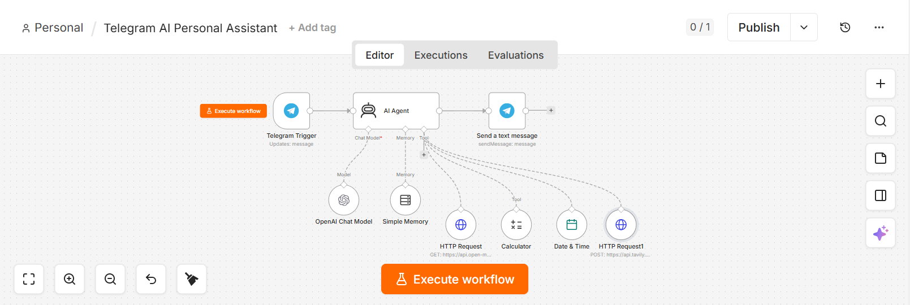
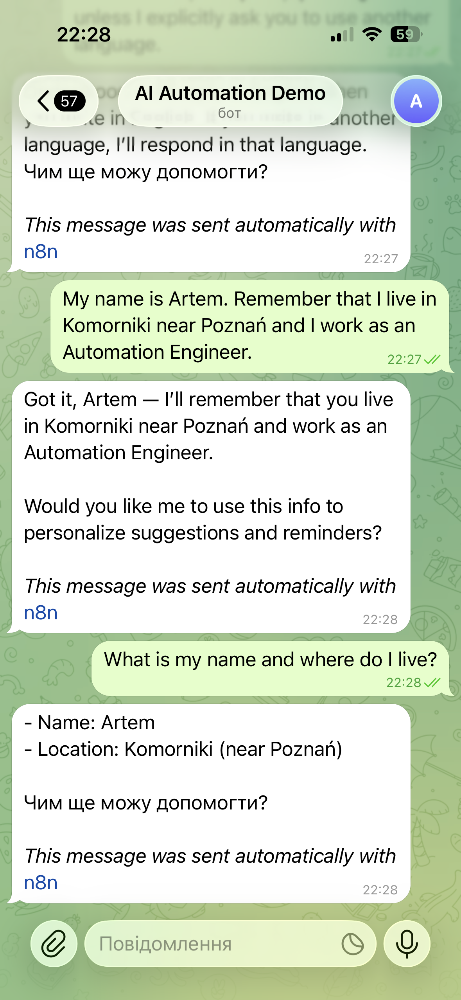
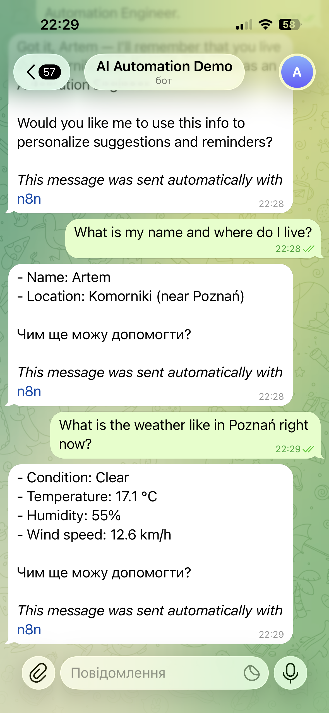
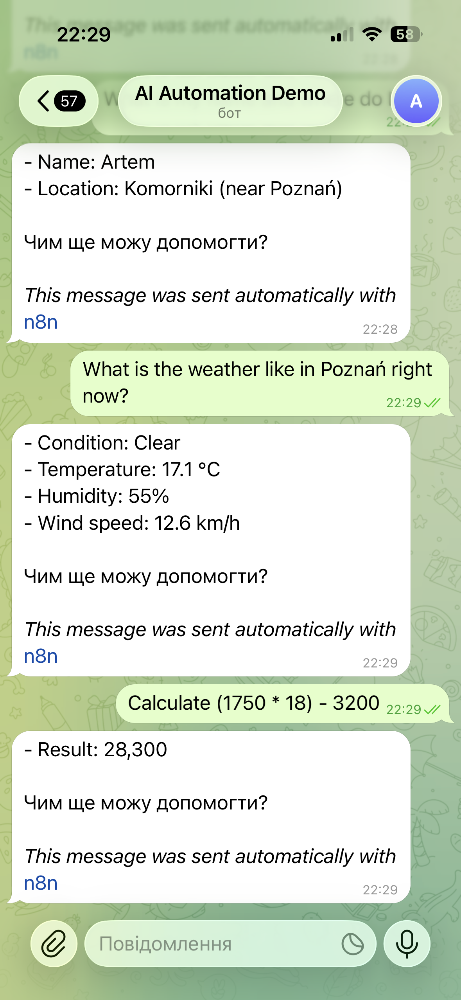
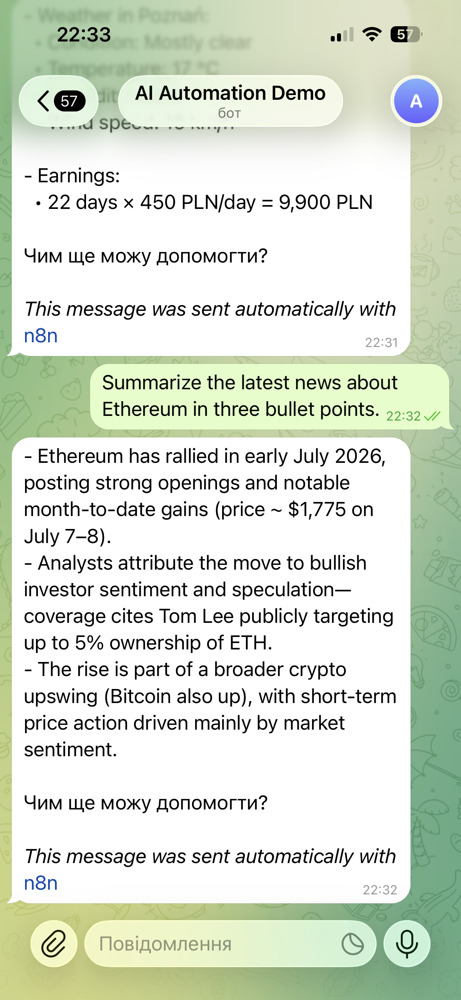

# AI Automation Journey

Hi! I'm Artem.

I'm learning AI Automation by building real-world business solutions with n8n, OpenAI and APIs.

My goal is to help businesses automate repetitive tasks and save time.

---

## Project

### AI Telegram Assistant

An intelligent Telegram assistant built with n8n.

### Features

- 🤖 AI conversations using OpenAI
- 🌤️ Real-time weather information
- 🧠 User memory
- ➗ Mathematical calculations
- 📰 Ethereum news summaries
- 🌍 Multi-language support

---

## Tech Stack

- n8n
- OpenAI API
- Telegram Bot API
- Open-Meteo API

---

## Workflow

---

## Screenshots

### Weather

### Memory

### Calculator

### Multi Tool

### Multiple Tasks

---

## Status

✅ Completed

More AI automation projects coming soon.
